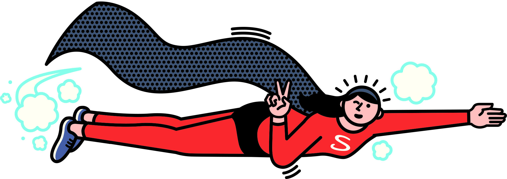
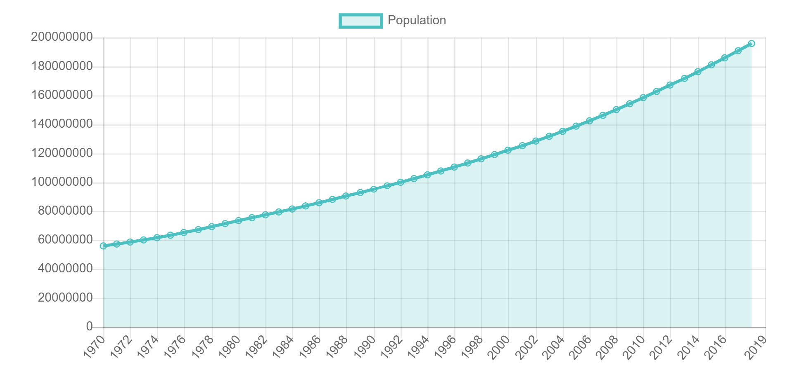
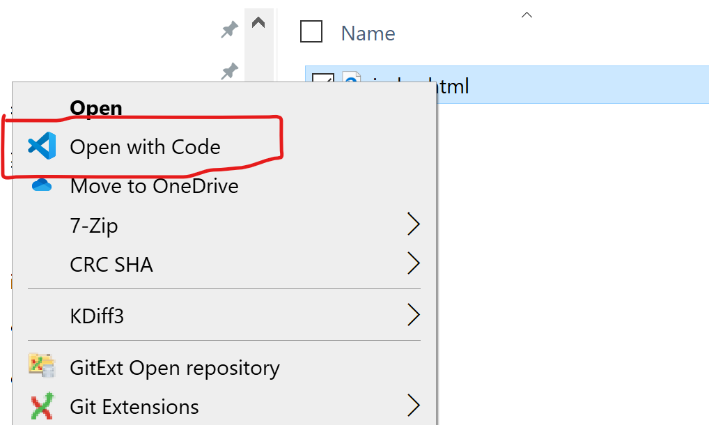
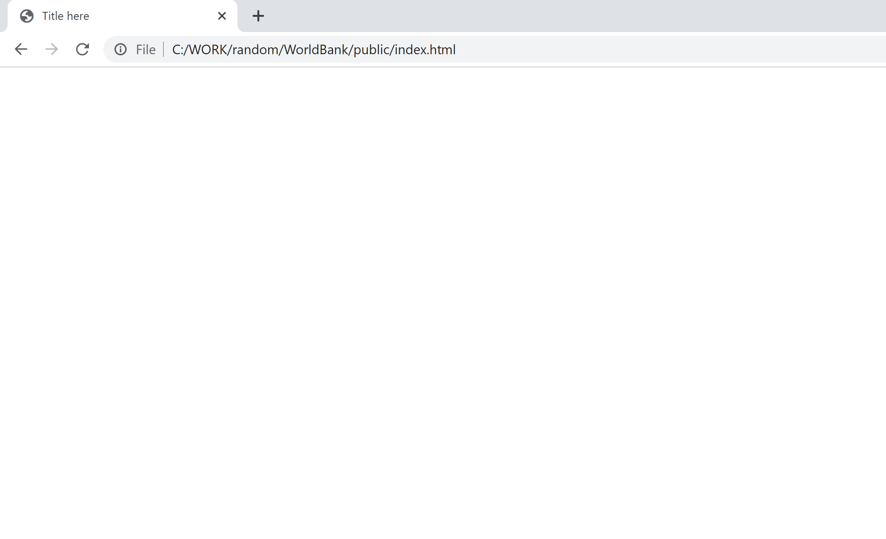
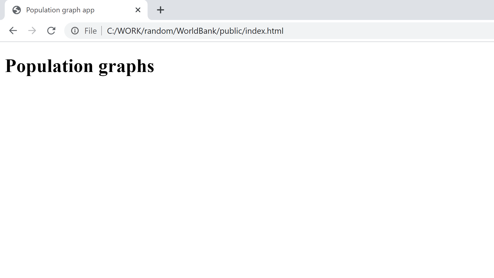
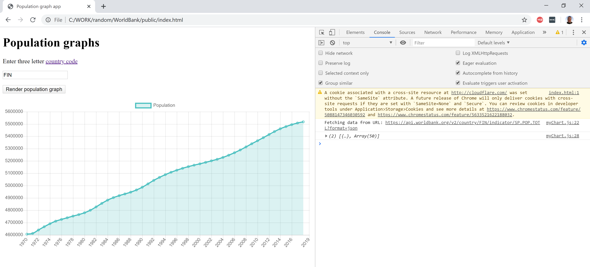
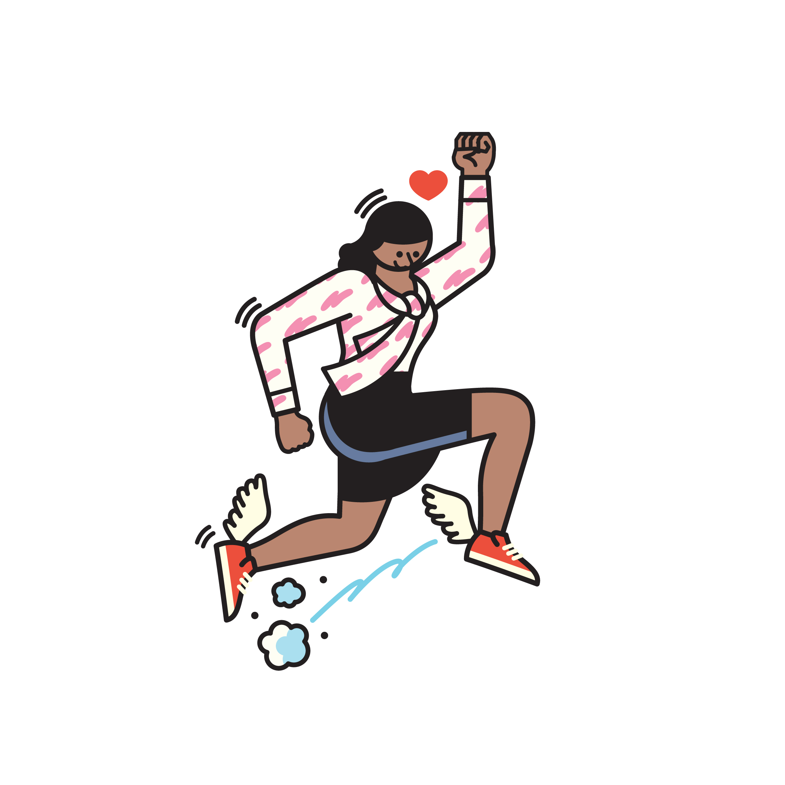
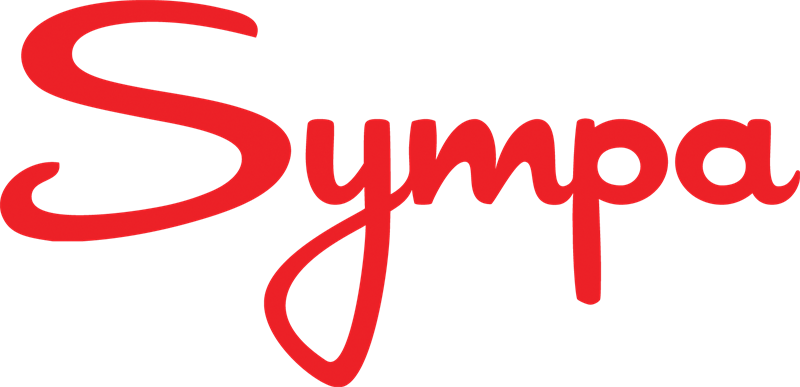
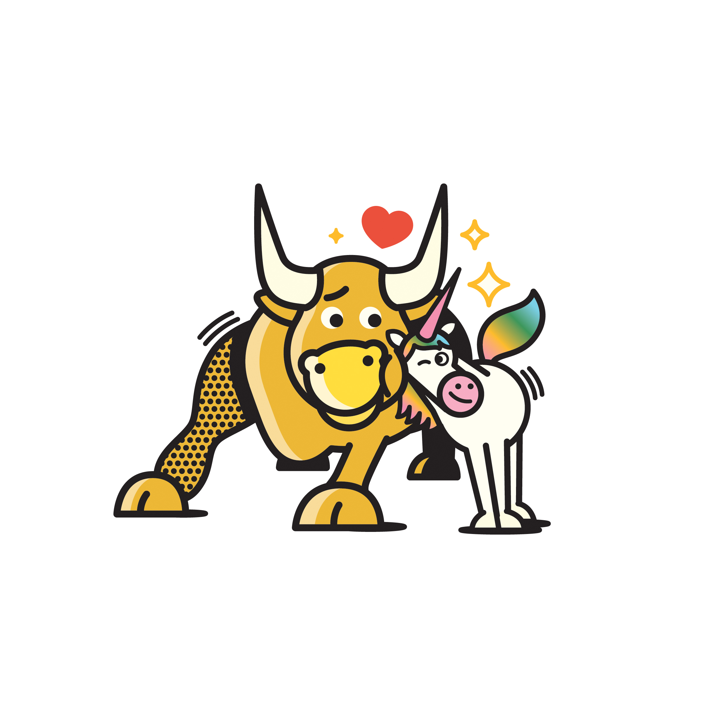

# Contents
{:.no_toc}

* Table of contents will be inserted here when this markdown is built by Jekyll
{:toc}

Welcome to the amazing world of web coding! On this **#mimmitkoodaa MOOC by Sympa** we will build a simple web app that can visualize population graphs for different countries. Let's look over some general information about the course first.

# Technical stuff about the course
## Time requirement for the course
Our estimate is that you should be to complete the pre-work part in 3-8 hours and to build the population basic graphs app in about 3-8 hours. After that there are several options for extra assigments to improve your own version of the app. This assumes no previous programming experience, but does assume that you are comfortable using a computer and a browser.

## Completing the course
If you wish to complete the course, follow the instructions for submitting your files at the end of the material. All finishers will get a course certificate. If you want to do the course just for learning, you can follow the material, do the quizzes and give feedback but skip submitting your files.

The quizzes in the material are meant to support your learning. The results are collected only anonymously. Completing the quizzes is not required for completing the course.

## Data privacy

The quiz answers and feedback for the course are collected anonymously. Filling in quizzes and giving feedback is optional. The quizzes and the feedback are implemented using Microsoft Forms.

The course submission form and willingness to demo form include personal data (name, e-mail). [Privacy policy](./privacy_policy.md) is available.

## Prerequisites
You will need to have Visual Studio Code installed on your computer. If you have not installed it, please do so now at [https://code.visualstudio.com/](https://code.visualstudio.com/){:target="_blank"}. Select the *Download for Windows* if you have a Windows computer. Or your own operating system. Install it with default setup. 

Visual Studio Code is a handy code editor. It's not too heavy but helps in many ways with coding. It for example colours the different kinds of HTML, CSS and Javascript elements in different colours to help you read the code. 

# Pre-work
Read and do the simple exercises in the following materials before continuing with this course. The pre-work will give you the basic understanding you will need for building the app on this course. All pre-work materials are by Mozilla. Total time required for the pre-work is ~3-5 hours. You can customize the depth of how you do the pre-work according to your background and goal for the course. If you for example already know HTML quite well, you can just skip the HTML part. If you are really interested, do all the small exercises given. But at a minimum read through the material and try some interesting small assignments on your computer.
- [Getting started with HTML](https://developer.mozilla.org/en-US/docs/Learn/HTML/Introduction_to_HTML/Getting_started){:target="_blank"}
- [What is CSS?](https://developer.mozilla.org/en-US/docs/Learn/CSS/First_steps/What_is_CSS){:target="_blank"}
- [Getting started with CSS](https://developer.mozilla.org/en-US/docs/Learn/CSS/First_steps/Getting_started){:target="_blank"}
- [What is JavaScript?](https://developer.mozilla.org/en-US/docs/Learn/JavaScript/First_steps/What_is_JavaScript){:target="_blank"}

# Build the Population graphs app
## Goal
In this short course, we are going to build a web app that can **visualize the population time series** for any country the user selects. Population time series are pretty interesting, they can tell their own stories about the history and present of countries. Some countries population is rapidly growing. Usually those are developing countries. Many western countries' population is stable or slightly declining. That means possible problems in the future as there is usually a larger pension-age population and less people in working age (partly or fully paying the pensioners' pensions!). Unfortunately major devastations like a civil war also show in a population graph as we will later see.  

So the beef of the app would be something like this graph (which shows the population graph of Nigeria):



We could at this point sketch a simple description of what the app should do:
1) User selects a country
2) User sees the population graph for that country

Simple. Let's try to keep it that way.

## Tools
So how are we going to build the web app? What will we need? Take a moment to name some of the technologies and things you can recall from the pre-work Mozilla tutorials - or just venture a good guess - before moving on. 

Guessed something? Good. Most likely you remembered some of the following:

- **HTML** (Hypertext Markup Language) for creating the structure of the user interface (UI, the page the user sees and can interact with) 
- **CSS** (Cascading Style Sheets) for defining the style, visual look of the page
- **Javascript**, a programming language, for creating the interactivity and logic for the app 

Essential tools! With those one can do great things! But there is one - maybe the most essential component - that was not on that list. We can't just randomly generate some numbers to show as the population of Sweden. Our app is worthless if we do not have the **data** to display.

Enter **World Bank**. Our friends in Washington D.C. provide loans and grants to the governments of poorer countries to make possible and speed up the development of those countries. But they also provide data. Lots of data. And a lot of that data is **open data**, meaning it's provided free of charge to anyone wanting to use it. Wait a minute: would they happen to have population data on countries all around the world? You guessed it. They do! But as we are coders building an automatic app, it is not enough that the data is open. It also has to be machine-readable. That means a format where we can easily access it and use it for our app. Fortunately it is. Next, let's take a look at what it looks like.  

## Data

World Bank offers the population data through an **API**, an application programming interface. In English, an API means that we can send a message to the World Bank computer system saying *Give me the population time series of Finland* and the system sends it back to us in a reply message. So it's like a defined way of talking to the World Bank system.

So how do we actually talk to the World Bank API? Well to get the population time series of Finland, we send a request to the address [https://api.worldbank.org/v2/country/FIN/indicator/SP.POP.TOTL?format=json](https://api.worldbank.org/v2/country/FIN/indicator/SP.POP.TOTL?format=json){:target="_blank"}. Whoa, that looks ugly and complicated! But hey, let's try it. So, open your browser (e.g. Google Chrome) and copy that address to the address input field and hit enter. Yes, do it now.

You should see a screen like this:


It looks... well... it looks like a lot of data. But let's take a closer look. We've circled a couple of points of interest in the picture. First, the data says *Finland*, so it looks like we indeed got back some data about Finland. The Finland marking in fact runs all the way down the page. Second, there's a list of what looks like year numbers running down the page. And third, next to the year numbers, there's values. For the circled year (2018), the value is 5 518 050. A bit over 5,5 million. Yes, that looks like the population of Finland. And these values seem to be associated with the years. So we can be pretty confident that we got what we asked for, a population time series of Finland. Just in a bit clunky format. The format is actually called **JSON** (JavaScript Object Notation), and this format is very widely used in transmitting data. If you want to read a bit more about JSON, you can read the first part of a Mozilla tutorial (*[No, really, what is JSON?](https://developer.mozilla.org/en-US/docs/Learn/JavaScript/Objects/JSON){:target="_blank"}*). 

<iframe src="https://forms.office.com/Pages/ResponsePage.aspx?id=qBDdu9lHMkWtPpjJdV-yPYuD9NDNst9Fg6lleCfSi2hUMVFNMUlLNzdLSkdaUlVZMlNTMURXTFlKRy4u&embed=true" frameborder= "0" marginwidth= "0" marginheight= "0" style= "border: none; width:100%; height:800px" allowfullscreen webkitallowfullscreen mozallowfullscreen msallowfullscreen> </iframe>

Now of course the API does not offer data on only Finland and only the total population. If you're feeling curious, you can see what happens if you exchange the FIN part in the address to ITA? What about if you change the part SP.POP.TOTL to SP.POP.65UP.FE.IN or SP.DYN.LE00.MA.IN? There seems to be a lot of data at our fingertips!

<iframe src= "https://forms.office.com/Pages/ResponsePage.aspx?id=qBDdu9lHMkWtPpjJdV-yPYuD9NDNst9Fg6lleCfSi2hUOTVSQkRVSDZHVzlZNTVRODBVS0w0R0ZFSC4u&embed=true" frameborder= "0" marginwidth= "0" marginheight= "0" style= "border: none; width:100%; height:800px" allowfullscreen webkitallowfullscreen mozallowfullscreen msallowfullscreen> </iframe>

## Basic view with titles
OK, so we know that we have access to the data we need for our app. Let's get started with building it. 

We'll start with a minimal HTML file. Download the [minimal HTML file](https://raw.githubusercontent.com/mikkokotola/populationgraphs/5ba3debb035a834d2695b2f0c4feb2c53cbc521d/public/index.html) from GitHub.

If you open the file in Chrome, it will most likely open in your browser as a page. You can save the file to your own computer by pressing `Ctrl + S`. Create a folder in a suitable location on your computer. Name your folder e.g. *PopulationGraphs* and save the file *index.html* inside that folder.

Now open the file in Visual Studio Code. You can do this by going to the file folder in Resource manager, right-clicking on the file and selecting *Open with Code*.



You should see a screen something like this:


Great! Now also try opening the file with your browser by double-clicking on it in Resource manager. You should see something like this:



It's pretty much a blank screen! But do notice the title of the page (*Title here*). And the fact that you were able to open the page with your browser. A browser is the main way to view web pages, so this was an important test: you have just verified that you are able to view the first version of your app as a user! OK, it does not do anything yet, but it works! 

Now, modify the *index.html* file in Visual Studio Code in the following ways (and save the file after the modifications):

- Change the title to *Population graph app*
- Add an heading (&lt;h1> element) inside the body of the document that says *Population graphs*

H1 heading... I know what it it, but how exactly was it written as code?, you may ask. A very good question! We will now share a secret with you. *You don't need to remember!* In fact *no coder remembers the exact way to write all code expressions*. Not after 1 year, and not after 10 years of professional coding experience. But it has to be written correctly (in professional speak the *syntax* needs to be correct) for the code to work. So what to do?

Well google it! Open Google and type in *H1 heading example*. Pick e.g. the result near the top that is from w3schools.com. And there you have it: an example of how to write an h1 heading in HTML.

This might be the most important thing you learn during this course. You do not have to remember the exact syntax for code. Of course you will learn and be able to write common things by heart, but if you don't remember, it's no problem. Just google it. Everyone does. (And quite soon you will find *Stack overflow*, a site specializing in sharing discussions around problems coders face - and solutions to them.)

So, you managed to change the title and add a heading. Now reload the file in your browser to verify that your changes are working. This is also important. Do code changes in small steps. Check after the changes that the changes work by reloading the document in your browser.



## Our aim: Walking skeleton, MVP
Our aim will be to get a minimal working version of the application as soon as possible. This is almost always the preferred approach to building an application. A minimal version that has all the needed parts is sometimes called the **Walking skeleton**. It has all the body parts but not much flesh around the bones. The reason for this approach is that it's easier to get the different parts to work together if it's done early on. Once we have all the needed parts and we know they work together, it's much less risky to add functionality and make the different parts prettier.

Our walking skeleton will have

- Possibility for the user to input a country
- Fetching the population time series for that country
- Showing the population graph

It will not be pretty, but that's not important at the walking skeleton phase.

Once our skeleton walks, we will make it prettier. At that point we will pretty much have a **MVP**, a *Minimum Viable Product*. An MVP is something that we could - and should - give to actual users to try out. It will not be perfect, but giving it to users to try out will give us information about if it does what the user needs it to do. And also about what they would like it to do and how we could improve it.


## Reading input from the user
So far we don't have any of the three parts of the walking skeleton. Let's get the first one done. Let's get input from the user on what country she wants to view a population graph for.

We will start simple. We've seen that we can fetch data based on a three-letter country code (like FIN). That's good enough. Let's offer the user a text field to type in a three letter country code.

Add the following HTML line under the &lt;h1> element in your index.html file:
```
    <input class='textinput' placeholder='Whoa!' type='text' id='country' maxlength='5'/>
```

Save the file and reload the page in your browser. Try inputting text into the field.

Let's look at the line we just inserted. It it an *input* element, which is used for getting user input. The input element has many *attributes*. It has *class*, which we will use later for making it prettier and an *id*, a unique identifier for this element which we will use in a moment. The class and id are not doing anything yet. But the *placeholder* is. And it's value is a bit funny. Change the value of the placeholder to `Country` and reload the page in your browser. The type *text* defines that we want text input and the *maxlength* limits the amount of characters the user can input. The current value is bit off. Fix it so that the user can only enter 3 characters. 

Nice. Let's also add an instruction text line so that the user can check what the 3-letter codes are if she can't guess it by heart. So add this line before the input element:
```
    <p>Enter three letter country code</p>
```

It's a paragraph (a &lt;p> element) with some text. But it would be nice to offer the user a link to check the three-letter codes (they are not all obvious). Add a link (an HTML &lt;a> &lt;/a> element) around the text 'country code' that takes the user to the page https://en.wikipedia.org/wiki/ISO_3166-1#Current_codes. Maybe it's also nice that the linked page opens in a new tab, so use the attribute `target='_blank'`, which makes the browser open the linked page in a new tab instead of the current tab.

Save the file and reload the page in your browser if you haven't already. From now on we will not say this every time after code changes, but you should *always* do it after changes to the code. This way you can see right away if your change does not work and fix it right away.

So the user is inputting three letter codes, but nothing is happening. Let's add a button below the input field that the user can press:
```
    <p>
        <button class='button' id='renderBtn'>Why? Sympaticos.</button>
    </p>
```

Notice that the button also has the *class* and *id* attributes. The button text is not very informative. Update it to 'Render population graph'.

OK, the button is there and can be pressed, but nothing is still happening. The button does not have any default functionality. We have to create it ourselves using Javascript.

## First script: log it, baby!

We will make something happen when the button is pressed by adding some *script* to the document. Let's add the code first, and then try it and analyze it piece by piece.

Add the following code just before the &lt;/body> tag (at the end of the body of the document):

```
    <script>
        // Define a function called logCountryCode. This function takes no arguments 
        // (the brackets after the function name are empty). When the function is called, 
        // the two indented lines of code are executed.
        function logCountryCode () {
            // Define a variable called countryCode. Put into it the value that is in the 
            //HTML element with id 'country'.
            var countryCode = document.getElementById('country').value;
            // Print the value of the variable countryCode into the console.
            console.log(countryCode);
        }

        // Add an event listener to the HTML element with the id 'renderBtn'. That's our 
        // button. When the event 'click' happens (when the button is clicked), run the 
        // function 'logCountryCode'.
        document.getElementById('renderBtn').addEventListener('click', logCountryCode);
    </script>
```

Notice how much easier it it to look at in Visual Studio Code with the colours indicating different types of elements. One pro tip for Visual Studio Code is also the key combination `Shift + Alt + F`, which formats the current document according to its type. So it formats HTML like HTML should be formatted and Javascript like Javascript should be, making it easy to read and saving you from manually having to fix indentations, linings and extra spaces in the code. Try putting some extra spaces in your code and then hitting `Shift + Alt + F`.

Now try out our updated app in your browser.

Eeeh. There's still nothing happening when you press the button. Or is there?

In your browser, hit `Ctrl + Shift + I`. You should see the *developer tools* opening up in your browser. Find the tab *Console* and click it. Now try entering some 3-letter codes and pressing the button. You should see the text you entered appearing in the console window immediately as you push the button. So it seems the code is writing the country codes to the console.


Now that you opened the console, try it out a bit more. Type or copy-paste `console.log('Hi there!')` in the console and hit enter. Try also `1+8`. And  `var result = 1+8` and then `result`.

<iframe src= "https://forms.office.com/Pages/ResponsePage.aspx?id=qBDdu9lHMkWtPpjJdV-yPYuD9NDNst9Fg6lleCfSi2hUMDRKOFBKTDJNTzg1U0xPMTUxQkhMWDBQRi4u&embed=true" frameborder= "0" marginwidth= "0" marginheight= "0" style= "border: none; width:100%; height:800px" allowfullscreen webkitallowfullscreen mozallowfullscreen msallowfullscreen> </iframe>

If you have something extra on your browser page during the quiz, just reload the page in your browser to reset it.

So when you type in Javascript code to the console, the console will execute it. Now type some country code into the input field and run `logCountryCode ()` in the console. You should see the text you had in the input field printed in the console. You have just *called* the function logCountryCode from the console. So the console executed the two lines of code inside that function. A **function** is a piece of code that can be reused by calling it several times. You can give a function some input parameters (our function does not have any, the brackets in the function definition are empty). And it always returns some value to the caller. You actually already saw in your console what our function returns: `undefined`. That's Javascript and means 'nothing'. Our function returns nothing. It currently does the logging and does not need to return any value to the caller.

So what is each line in our code doing? Try reading the code now if you have not yet done so, and see if you understand some of the lines.

You will notice that the code has comment lines, which start with `//`. Those lines are just comments (they are not really part of the code). They are meant for humans reading the code to clarify what the code is doing. These comments are very long and meant for learning. Usually there are only few comments in code. Code should be self-explanatory thanks to well-named variables and functions. 

The comments pretty much translate to English what the code is saying in Javascript. First define a function (a reusable chunk of code) that gets the text that is currently in the input field and prints it in the console. Then attach an event listener to the button and tell the button to call the function when it is clicked.

Now this might have sounded quite complicated to you. No worries. This was a huge leap forward and introduced several very big programming concepts: *variables*, *functions*, *events* and *callback functions* (that's what it's called when you assign the function to the event listener: when the 'click' event occurs, call this function). You don't have to understand every bit of the code fully yet. Focus on grasping on a higher level what each part does.

But hey: We were able to read in input from the user and use it (print it in the console). The first of the three parts of the walking skeleton ready! Good stuff!

## Keep it clean: script to a separate file

We have written script directly into the HTML file. That works and is fine if you are doing something very small. But best practice is to have the scripts in a separate file. That way they are cleaner to read and edit and easier to reuse. So let's create a separate file and move our current scripts there.

Create a new file in Visual Studio Code by clicking *File*->*New File* at the top left corner. This creates a new file and opens it. Now click *File*->*Save As*. Then, in the dialog, click the *Save as type* and select *JavaScript(\*.js...)*. Then modify the file name to be *myChart.js* and click *Save*.

Now copy everything *between* the *&lt;script>* and the &lt;/script> tags (but not the script tags) in the *index.html* to the new *myChart.js* and save that file.

Then delete the whole script block within *index.html*. And insert the following line at the end of the *head* of your *index.html*:
```
    <script defer src='./myChart.js'></script>
```

Now try the app in your browser and check that the country codes are still logged to the console when you click the button. If they are, your change works! If not, you can compare your current files to the ones here:

- [index.html](https://github.com/mikkokotola/populationgraphs/blob/994708304bc15f8cdb31bf0d16ee7eef701ce127/public/index.html){:target="_blank"}
- [myChart.js](https://github.com/mikkokotola/populationgraphs/blob/994708304bc15f8cdb31bf0d16ee7eef701ce127/public/myChart.js){:target="_blank"}

So what did we just do? It's called **refactoring**. We changed the structure of the code without changing how the code works. We moved the Javascript code from within the *&lt;script>* tags to a separate Javascript file (with a file ending .js) and added one line in the head of the *index.html* to load those scripts from the separate file. 

The attributes of the loading line are important. The first one is *defer*. This tells the browser to wait for the HTML structure to load before running the script file. If we did not have this, the browser would try to look for the button to attach an event handler to, but would not find any button, because it would not have been created yet. The second attribute is *src='./myChart.js'*. This just tells where the script to load is located (the *src* is short for *source*). The *./* part means to look in the same folder as where the *index.html* is located.

Great, now we can write new scripts in the file *myChart.js* and they will always be loaded when we reload the index.html in our browser!


## Fetching data
Let's move to the second part of the walking skeleton: fetching the population time series for a country. For this, we'll be working inside the file *myChart.js*.

We already know where to get the World Bank data. The example URL that we looked at before was https://api.worldbank.org/v2/country/FIN/indicator/SP.POP.TOTL?format=json. And we also found out that the two important parts of the URL were *FIN* (the three-letter code for Finland), where we select the country, and *SP.POP.TOTL* (the indicator code for total population count), where we select the indicator that we want to data for. In the main part of this course, we will only be using the indicator *SP.POP.TOTL* but will be changing the country (but there is a bonus assignment challenging you to try another indicator).

So, insert the following code into the bottom of the file *myChart.js*:
```
async function fetchData() {
    var countryCode = document.getElementById('country').value;
    const indicatorCode = 'SP.POP.TOTL';  
    const baseUrl = 'https://api.worldbank.org/v2/country/';
    const url = baseUrl + countryCode + '/indicator/' + indicatorCode + '?format=json';
    console.log('Fetching data from URL: ' + url);

    var response = await fetch(url);

    if (response.status == 200) {
        var fetchedData = await response.json();
        console.log(fetchedData);
    }
}
```

And then modify the line where we attach a callback function to the event listener (remember, this just tells the event listener which function to call when someone clicks the button). Change the `logCountryCode` on that line to `fetchData`.

Try it out by entering *FIN* and pressing the button.

You should see something new in your console. The first line is understandable. It says 'Fetching data from ' and then shows the same URL we've already seen. But the second line looks a bit more weird.


At least it says Array(50). And there's a small black triangle on the left side of it. Click the triangle. And click the triangles next to the 0 and 1 that appeared. And then again the 0 and 1 under the higher-level 1. You should see a view like this:


Hah! It appears we have the same data here that we looked at before. The first part (upper-level 0) is **metadata**, data describing the actual data that we requested. It tells us how many pages there are, how many data items are on a page, how many there are in total and when the data was last updated. The second part (upper-level 1) is the population time series. It is an **array**, which basically means a list of several items. The current array that we have appears to have 50 items in it. The first data item (the 0 under the upper-level 1) has the population count for the year 2019. Wait a minute, no it doesn't. The value says *null*. Looks like World Bank hasn't got the figures for last year yet. The next item, year 2018, looks better. Finland's population was 5 518 050 in the year 2018. And the following items look good.

So what did the new code do? Well, our new function fetchData does what it promises, fetches data. The first line we already know: it gets the current value of the text input field (found by using the id 'country') and saves it in a variable called *countryCode*. The next line is similar but simpler. We just create a new variable called *indicatorCode* and assign the value 'SP.POP.TOTL' to it. Except there's the keyword *const* instead of *var*. *Const* is short for *constant variable* (whereas *var* is short for variable). Constant just means we set the value once and it never changes. The next line is the same. We create a constant called *baseUrl* and assign the first part of the World Bank API URL to it. The fourth line creates another constant called *url*, where it concatenates (puts one after another) the needed pieces of text (technically called **strings**): the baseUrl, the countryCode, then the text `/indicator/`, then the indicatorCode and finally `?format=json`. If we enter the letters FIN, the constant *url* will be exactly the same as the sample URL we have looked at, https://api.worldbank.org/v2/country/FIN/indicator/SP.POP.TOTL?format=json. We can confirm this also in the console, because on the fifth line we log the value of that constant. Using `console.log()` is often a very good idea when developing new Javascript code. And it's not just beginners: it's popular also amongst seasoned developers. It's simple and it just works.

The sixth line of code is the most important one in this function:
```
var response = await fetch(url);
```

The first part is familiar. We are again creating a variable called *response*. But what are we assigning into it? The core here is `fetch(url)`. **Fetch** is a built-in tool for sending **HTTP requests**. HTTP is the protocol (defined way of exchanging messages) that is used for loading and sending data to websites. You have most likely heard of it, because your browser uses it when you are loading web pages or sending data by filling in forms on web pages. The HTTP protocol is also used many APIs, like the World Bank API. That's why we could so easily request data using our browsers.

So we give our url to *fetch* and it sends an HTTP request to that URL. Thanks to the keyword *await* on the row, the browser waits for the HTTP response from the World Bank servers and then assigns the HTTP response to our variable *response*. The *await* has to be there because it takes some time for the request to be transferred over the internet to the World Bank servers (which might be in e.g. USA), the servers to create the response and for the response to be transferred over the internet back to the computer the browser is running on. This type of operation, one that we have to wait for the response to, is called **asynchronous**. And that's why we have the *async* keyword in front of our function definition: it's defining that this function contains asynchronous parts and will not finish immediately.

So after that line (and a bit of time, maybe about 0,8 seconds), we have an HTTP response in the variable *response*. In the next line, we are checking if the status code of the response is 200. 200 means everything went fine and the request was successful and we should have the data we requested in the response. If the status code is 200, the two lines inside the if-block will be executed. If the status was something else, those lines will not be executed and nothing more will happen.

If the code is 200, then the first line converts the body of the HTTP response to JSON format (the format that we saw before in our browser and also in our console) and saves that data into the variable *fetchedData*. The second line logs that data into the console. So that's how it ended up there for us to look at.

Now that was a tad complicated. If you did not understand everything, don't worry. On the other hand, if you are really keen on learning more about this part, please open the *Network* tab on your browser's developer tools and investigate a bit more what happens when you run your app (and possibly grab an instructor by the sleeve). You can also read more about [HTTP status codes](https://developer.mozilla.org/en-US/docs/Web/HTTP/Status){:target="_blank"} if you're interested. But for the current task, this level of understanding is more than sufficient.

Looks like we have two out of three down on our walking skeleton list!:

- Possibility for the user to input a country - DONE
- Fetching the population time series for that country - DONE
- Showing the population graph

## Visualizing data

Our walking skeleton is only missing its legs. Let's attack the last part: visualizing the population time series.

Here's some good news: visualizing data is very common in web applications, so it has been done before. And because coders like to reuse their previous work, people have built ready-to-use high-level tools for creating charts and graphs. And many of them are free to use and **open-source** (meaning the source code is available publicly for anyone to read and to contribute to). We are going to do our visualizations using [Chart.js](https://www.chartjs.org/){:target="_blank"}.

We will need two additions to *index.html*. First, add the following code the head section (before the myChart.js script line):
```
    <script defer src='https://cdnjs.cloudflare.com/ajax/libs/Chart.js/2.7.2/Chart.js'></script>
```

This code will load the code for Chart.js into the browser from their hosting site. So we're loading the tool needed for creating the visualization. Notice that this line is very similar to loading our own script.

Second, we need to add an HTML element where we can render the population graph. Graph.js requires a *canvas* element that can be used for drawing 2-dimensional graphics and animations. Add it by inserting this line at the end of the body:
```
    <canvas id='myChart'></canvas>
```

Let's move to the file *myChart.js*. Add the following three helper functions to the end of the file:
```
function getValues(data) {
    var vals = data[1].sort((a, b) => a.date - b.date).map(item => item.value);
    return vals;
}

function getLabels(data) {
    var labels = data[1].sort((a, b) => a.date - b.date).map(item => item.date);
    return labels;
}

function getCountryName(data) {
    var countryName = data[1][0].country.value;
    return countryName;
}
```

These helper functions will extract the actual population counts, the year labels and the country name from the data array that we got from the World Bank (and that we printed in the console). In essence, each method takes the whole data array, selects only the main time series list (not the metadata) for processing, sorts it by year and selects only the wanted piece of data from each year. Remember how it had a lot of extra data that we won't need for the population graph. These methods will provide us with just the data we need. They are not being called yet, so they won't do anything yet.

Then we'll see how our new tool works. Let's add this function that will render the actual population graph using the population data, the year labels and the country name:
```
function renderChart(data, labels, countryName) {
    var ctx = document.getElementById('myChart').getContext('2d');
    
    // Draw new chart
    new Chart(ctx, {
        type: 'line',
        data: {
            labels: labels,
            datasets: [{
                label: 'Population, ' + countryName,
                data: data,
                borderColor: 'rgba(75, 192, 192, 1)',
                backgroundColor: 'rgba(75, 192, 192, 0.2)',
            }]
        }
    });
}
```

The first row looks quite similar to what we've already seen. It finds an HTML element using the id *myChart*. It then gets the 2d-context of that element (the canvas) and saves it to the variable *ctx*. You can think of this context as a 2-dimensional whiteboard that we can use for drawing. 

The rest of the code consists of a call `new Chart(ctx, {...})`. This is where we are telling the Chart.js tool 'Draw a new Chart ON this 2-d whiteboard (*ctx*) using this data and these labels'. The `type: 'line'` sets the type of chart as a line chart. The *label* defines a label for the line. The `borderColor: 'rgba(75, 192, 192, 1)'` defines what colour we want the line to be. It is defined using values for red, green, blue and alpha (for transparency). The *backgroundColor* does the same for the fill colour of the chart.

We've got all the pieces now. Let's put them together by modifying the if-block within the fetchData() function. Add the four lines below at the end of the if-block. The whole if-block will then look like this:
```
    if (response.status == 200) {
        var fetchedData = await response.json();
        console.log(fetchedData);

        var data = getValues(fetchedData);
        var labels = getLabels(fetchedData);
        var countryName = getCountryName(fetchedData);
        renderChart(data, labels, countryName);
    }
```

The top three new lines will call the functions we defined above. The first line extracts the actual population data values from the fetchedData object. The second line extracts the labels. And the third line extracts the countryName. The fourth new line gives the data, the labels and the countryName to the function renderChart asking it to draw the chart.

Time to try it out in the browser!

Woohoo! We have liftoff! With the country code FIN, it should look like this:



**The skeleton is walking!** Try with some different country codes. Celebrate! Have a cup of coffee, you've earned it! 

<iframe src= "https://forms.office.com/Pages/ResponsePage.aspx?id=qBDdu9lHMkWtPpjJdV-yPYuD9NDNst9Fg6lleCfSi2hUNzk4NkgwRzg4VjNKV1NCNERVNjRMOUdTRC4u&embed=true" frameborder= "0" marginwidth= "0" marginheight= "0" style= "border: none; width:100%; height:800px" allowfullscreen webkitallowfullscreen mozallowfullscreen msallowfullscreen> </iframe>

If this is all you have time for, you can be proud. You have just built a working web app! You are running it locally, but it could easily be put to a hosting service, available for anyone to use.

If you still have time, there are still several things we can do to improve the app.


## Clean-up

Time to do some clean-up. We are no longer using the function logCountryCode so remove it from the js file. Remove also the comment before the event listener line. So the first line of the file will be ` document.getElementById('renderBtn').addEventListener('click', fetchData);` after the clean-up.

Cleaning up dead code is important. If you don't, your files will become cluttered with unused code and it will be hard to figure out what is actually being used and what is not. Keep it clean.

## Bug-hunting

At this point you might have noticed that there is a bug in our app. Can you find it? When does it occur? Do you have ideas on what might be causing it? Try to find it and think about it a bit before continuing. 

<iframe src= "https://forms.office.com/Pages/ResponsePage.aspx?id=qBDdu9lHMkWtPpjJdV-yPYuD9NDNst9Fg6lleCfSi2hUMDFONUw5MEYwUFlYVjIzVEM5M1NOQ0ROMi4u&embed=true" frameborder= "0" marginwidth= "0" marginheight= "0" style= "border: none; width:100%; height:800px" allowfullscreen webkitallowfullscreen mozallowfullscreen msallowfullscreen> </iframe>

How could we fix the bug? The root cause is that we are not cleaning up our whiteboard in between drawing different population graphs. So there are several there, although only one at a time is displayed. Let's fix the bug by saving a reference to a chart when we draw it, and then wiping the previous chart away before drawing a new one. You can accomplish this by

- Defining a variable `var currentChart;` *outside* all functions. A variable like this is global and can be accessed by all functions. It's like a hook on which we'll always put a pointer to the current chart. So add a new line at the very top of the js file with the content `var currentChart;`.
- Saving the reference to the chart to that variable when a new chart is created. This is where we put the pointer to the hook that we just created. So modify the line that starts `new Chart(...` to start like this  `currentChart = new Chart(...`
- Destroying the old chart (if it exists) before drawing a new one. Let's add an if-block just before the line that we modified in the previous bullet (the one that starts `currentChart = new Chart(...`). Add this to that spot in the file: 
```
    if (currentChart) {
        // Clear the previous chart if it exists
        currentChart.destroy();
    }
```
Bullets 2 and 3 should result in the beginning of the function renderChart looking like this:


There is (sort of) also another problem. Even though the population graph looks visually nice, the population changes always look quite dramatic. That is because by default, Chart.js does not start the y-axis at zero. It would be more truthful to start the y-axis at zero. Let's add the needed parameters to the `new Chart(...)` definition. The new part is the *options* part. 
```
    currentChart = new Chart(ctx, {
        type: 'line',
        data: {
            labels: labels,
            datasets: [{
                label: 'Population, ' + countryName,
                data: data,
                borderColor: 'rgba(75, 192, 192, 1)',
                backgroundColor: 'rgba(75, 192, 192, 0.2)',
            }]
        },
        options: {
            scales: {
                yAxes: [{
                    ticks: {
                        beginAtZero: true
                    }
                }]
            }
        }
    });
```

Much better.

## Make it look nice
Let's face it. The skeleton walks but the bones are still showing. We have to make it a bit nicer before showing it to any users (and before we can call it an MVP).

We will make it nicer by using the third central technology of web apps, CSS. 

As before, let's do a quick improvement by using a ready stylesheet that someone has build for us. In this case originally Twitter. We'll load the Bootstrap stylesheet by adding the following line to the header of our *index.html*. A good place for it is before the *script* lines in the header.
```
<link rel="stylesheet" href="https://maxcdn.bootstrapcdn.com/bootstrap/4.0.0/css/bootstrap.min.css" integrity="sha384-Gn5384xqQ1aoWXA+058RXPxPg6fy4IWvTNh0E263XmFcJlSAwiGgFAW/dAiS6JXm" crossorigin="anonymous">
```

Notice how it looks a bit similar to how we loaded the scripts. It says it's a stylesheet and points to an address that the stylesheet can be loaded from. The integrity marking makes sure that we get the stylesheet that we are supposed to (that it hasn't been corrupted in transfer or tampered with by a 3rd party). 

Once you have added this, check out how it changes the look of the page. Much better already! 

Maybe it would look better if we centered all content. For this, let's do two things. First, wrap everything in the body of the *index.html* into a div: `<div class='content'>...some lines...</div>`. This trick will make it easier to center everything. Second, create a new file called styles.css (select CSS as the file type in Visual Studio Code when saving it). Now add the following style definition in the css file:
```
.content {
    text-align: center;
}
```

To take our own stylesheet into use, we have to import it like we did with the Bootstrap stylesheet. Place our own stylesheet link *after* the Bootstrap link. The order matters because in CSS, the latter style definitions will in some cases overwrite those defined earlier. 
```
    <link rel="stylesheet" href="./styles.css">
```

It looks much better now! The population graph is maybe a bit large. Let's limit the max size of the canvas. Do similar steps for the canvas: first wrap the canvas element in a `<div class='container'>...</div>` and then add a CSS definition for the class *container* that sets the width of the container to 75% of the width of the whole browser window: `width: 75vw;`. Add also this style definition in the separate css file (styles.css), it's always good practice to keep the styles in the separate file.

Looking good now! Seems like we have an MVP!

## Wrap-up
What have we done? Short answer: we've built a working **front-end** application. Front-end refers to code that is executed in the user's browser: the HTML, CSS and Javascript. The front-end communicates with a **back-end**, which means servers where the application data is stored (usually in databases of some kind). In our application's case the back-end was offered by the World Bank; we did not have to build a separate back-end for our app since we did not need e.g. authentication of the users or save any data about the users. The World Bank had done a lot of work collecting and preprocessing the data, has it stored in databases and offers it to us through a web API. Thank you World Bank! Very often the front-end communicates with the back-end using HTTP requests, just like our front-end does.

During this course, you have learned to work with the essential technologies of current web applications: HTML, CSS and Javascript. You have got your hands on some real World Bank data and used some tools offered to us by the web community: the visualization library Chart.js and the Bootstrap stylesheet. You have built a working web app. How was this possible? One notable factor making this possible is **openness**. We used open data from World Bank, open source code (the app itself and the mentioned tools) and worked using the open internet. Another view into the app is that we composed it by using several quite high-level pieces. This is in fact how many of the applications and services are born: the starting point is a customer need or an idea for a new service, and the application is built to realize that idea by using many different data sources and ready software components. There is not necessarily that much own code, and the code that is there is mainly tying together the different components to produce something new, something unique.

That's it for the basic part of this course! Hopefully you have enjoyed the journey and have some new skills and insights to take home! If you still want to continue learning and improving your Population Graphs app, there are several options for extra assignments below. But at this point, please submit your code files and take a moment to give feedback about the course.

# Feedback and submission
## Feedback
We would love to get some feedback from you. Feedback helps us recognize what is working and which parts we should still improve for the future.

Give feedback now about the main part (up to part wrap-up) using the [feedback form](https://forms.office.com/Pages/ResponsePage.aspx?id=qBDdu9lHMkWtPpjJdV-yPexVQAMN-VxKqazZ40sdgU9UMU40VlcxNjNYOFVMUkxVVzlMWUtQQ0NQVSQlQCN0PWcu){:target="_blank"}. It will take you about 3-5 minutes. 

## Submit your files
Make sure you have the three files (index.html, styles.css and myChart.js) named exactly as instructed.

Fill in the [submit your files form](https://forms.office.com/Pages/ResponsePage.aspx?id=qBDdu9lHMkWtPpjJdV-yPexVQAMN-VxKqazZ40sdgU9UNlhLVURVOTY2UUZEV0VKTDhDRVZVWkVKWCQlQCN0PWcu){:target="_blank"} to submit your files. After filling in the form, you will be displayed a link for submitting the files. 

After submitting, you will get an e-mail. If your submission passes the automated tests, your course certificate will be attached. If your submission does not pass all tests yet, you will get feedback on which tests are not passing, so you can fix your files and try submitting again.



## Willingness to demo
If you have done some extra assignments after the initial submission and you would be willing to demo your version of the Population graphs app, please fill in your info here! We will select a few participants for demoing from those who have indicated their willingness. The online demo & interview session right after the course on 21.4.2020 at 17.00-17.45 (Finnish time). Everyone is welcome to join the session!

Fill in the [willingness to demo form](https://forms.office.com/Pages/ResponsePage.aspx?id=qBDdu9lHMkWtPpjJdV-yPexVQAMN-VxKqazZ40sdgU9UNDYxSjhUMTlQVFAwMUw5NEcyV0c0RklPUiQlQCN0PWcu) at the latest at 19.4.2020 23.59.

# Extra assignments
If you are still eager to learn more and improve you app, here are some assignments to improve the app. However, before continuing, submit your files in their current state as you will be altering them during the extra assignments and they may no longer pass the automated checks after the alterations. 

You can look through the extra assignments and pick any you would like. The order does not really matter. The assignments do not have as detailed instructions as you have previously seen and will require you to think about what you want to achieve and find solutions yourself. Which is what coding is all about!

## Small assignments
- **Change the chart type to bar chart.** Look at Chart.js documentation for [bar chart](https://www.chartjs.org/docs/latest/charts/bar.html){:target="_blank"}. Switch your chart to be a bar chart instead of a line chart. Hint: this can be done by changing only one line in your code.
- **Make your chart animation slower.** Add the configuration animation duration into the options part of your call to create the chart (same part where you set the y-axis to start at zero). The configuration sets the amount of time the animation of your chart takes in milliseconds. To set it to 10 seconds (= 10 000 milliseconds), you would do:
```
options: {
    animation: {
        duration: 10000
    }
}
```
- **Customize the look of the graph** by adjusting the Chart.js parameters. For colours, see e.g. [Mozilla color picker tool](https://developer.mozilla.org/en-US/docs/Web/CSS/CSS_Colors/Color_picker_tool){:target="_blank"}
- **Customize the look of the page** by altering the CSS. Try e.g. changing the font or font size or padding of elements. Or substitute the Bootstrap for another style sheet like [Materialize](https://materializecss.com/getting-started.html){:target="_blank"}.
- **Get data for 60 years instead of 50.** As you have noticed the World Bank API is returning us data for the year range 1970-2019. Exactly 50 years. Why exactly 50 years? This has a direct connection to the first part of the response, which looks like this: `{"page":1,"pages":2,"per_page":50,"total":60,"sourceid":"2","lastupdated":"2020-02-27"}`. World Bank is offering the data separated into several pages. The metadata also tells us that there actually is 60 years worth of data available. Look at the [documentation](https://datahelpdesk.worldbank.org/knowledgebase/articles/898581-api-basic-call-structures){:target="_blank"} and change your code so that is requests 60 items per page instead of the default 50. After the change, you should see a population graph for 60 years instead of 50. Hint: try the request with your browser first to get it to work, and then move to editing the code.
- **Change the indicator that the app fetches.** So instead of the country's total population, fetch e.g. SP.POP.65UP.FE.IN or SP.DYN.LE00.MA.IN. The different age segments for the SP.POP are 0014 (0-14), 1564 (15-64) and 65UP (65-). The gender codes are FE (female) and MA (male). You can also google the World Bank API and try look for other interesting indicators that are offered as time series. 

## Medium-size assignments
- **Show country name and indicator name.** Our app is currently showing the country name only as a label within the graph. Add separate text paragraphs that display the country name and the indicator name. We are already extracting the country name from the fetchedData in the function getCountryName(data). Use that as an example and figure out how to extract the indicator name in a similar function getIndicatorName(data).
- **Fetch information about the capital city and area of the country, and the image of the country flag** from [RESTCountries API](https://restcountries.eu/#api-endpoints-code){:target="_blank"} and display those along with the population graph. You will need to create new HTML elements and make a similar API request to RestCountries as you did to the World Bank API. For a point of comparison, you can look at the master branch of the [Population graphs repository](https://github.com/mikkokotola/populationgraphs){:target="_blank"}.
- **Error handling.** Our app does not currently really have error handling. Implement error handling for cases when the user inputs an incorrect country code or when fetching the data fails (due to e.g. unavailable internet connection). You should probably use a try-catch block and add HTML elements for displaying errors. Again, for point of comparison look at the master branch of the repo.

## Large assignments
- Implement way for the user to **select the country using a drop-down menu** instead of typing in a country code. You can fetch the list of countries from a World Bank API at address [https://api.worldbank.org/v2/country?format=json&per_page=400](https://api.worldbank.org/v2/country?format=json&per_page=400){:target="_blank"}. For comparison, look at the branch [dropdowncountryselection](https://github.com/mikkokotola/populationgraphs/tree/dropdowncountryselection){:target="_blank"} of the repository.
- Implement functionality to select the age segment to display (see the age segments under Small assignments).

## Feedback for the extras
Give feedback about the extra assignments using the [feedback form for extras](https://forms.office.com/Pages/ResponsePage.aspx?id=qBDdu9lHMkWtPpjJdV-yPexVQAMN-VxKqazZ40sdgU9UQkNKRDdZT1JKV0lORjQ2NFlNSkJEN1BZNCQlQCN0PWcu){:target="_blank"}. It will take you about 3-5 minutes. 

# What next?
If you want to continue learning coding, the MOOCs offered by the University of Helsinki's Department of Computer Science at [mooc.fi](https://www.mooc.fi/){:target="_blank"} are an excellent choice. Mooc.fi offers courses in English and Finnish.

# What is Sympa?
The Sympa HR solution was designed to improve the lives of HR across the world. Providing companies an aggregated, clear view on all people data and unlimited integrations to other softwares, it supports smart decision-making and helps automate routine tasks. Backed up with great customer support, it's currently used by more than 700 organisations - and has one of the highest customer satisfaction rates in HR technology in Europe. [Sympa](https://www.sympa.com/){:target="_blank"} employs 120 people internationally, with offices in Finland, Sweden, Denmark, Norway and the Netherlands.

Read the [interview of Irene Koskinen](https://www.sympa.com/fi/blogi/koodaava-ex-katilo-irene-koskinen-kannustaa-mimmeja-tekniikan-pariin/){:target="_blank"}, a sympatico (in Finnish).

Check out the [careers](https://www.sympa.com/about/careers/){:target="_blank"} opportunities.



# Contributing
This course material is licenced under the <a rel="license" target="_blank" href="http://creativecommons.org/licenses/by/4.0/">Creative Commons Attribution 4.0 International License</a> and the Population graph app is licenced under the [MIT license](https://github.com/mikkokotola/populationgraphs/blob/master/LICENSE){:target="_blank"}. This means that both the material and the app are open source. You can contribute, modify, build upon and use the material (except for the Sympa illustrations) as long as you give appropriate credit to the original authors, provide a link to the license, and indicate if changes were made.

So if you have ideas on improving the material (fixing mistakes, explaining something better, adding new assignments or even whole new parts), please [fork](https://help.github.com/en/github/getting-started-with-github/fork-a-repo){:target="_blank"} the Github repository to your own account, improve and submit a pull request to the repository in question. If you don't have a Github account, you can create an account right away (for free) at [https://github.com/](https://github.com/){:target="_blank"}.

* Repository for the course material: [https://github.com/SympaOy/webcodingforbeginners](https://github.com/SympaOy/webcodingforbeginners){:target="_blank"}
* Repository for the Population graphs app: [https://github.com/mikkokotola/populationgraphs](https://github.com/mikkokotola/populationgraphs){:target="_blank"}

# Thanks
Thanks to 
- *[#mimmitkoodaa](https://mimmitkoodaa.ohjelmistoebusiness.fi/)* for amazing work in diversifying the coder tribe in Finland
- *Sympa* for participating in #mimmitkoodaa and making possible this course
- *World Bank* for the data
- *Mozilla* for the tutorials
- *University of Helsinki* and especially *Matti Luukkainen* for excellent examples on how to build and implement MOOCs. This MOOC follows the same spirit and borrows happily the ideology and pedagogy.



# Technical
Author: Mikko Kotola 2020  
License for material except illustrations: CC-BY-4.0 <a rel="license" href="http://creativecommons.org/licenses/by/4.0/">Creative Commons Attribution 4.0 International License</a> (CC-BY-4.0)  
License for code contained in the material: MIT  
Illustrations: (c) Sympa  
Made using markdown  
World Bank data license: CC-BY-4.0  